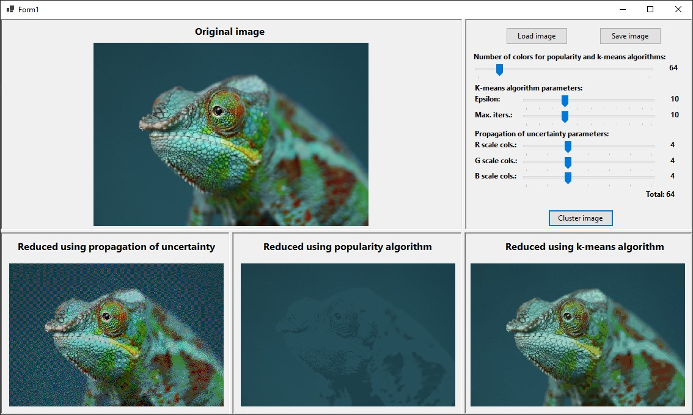
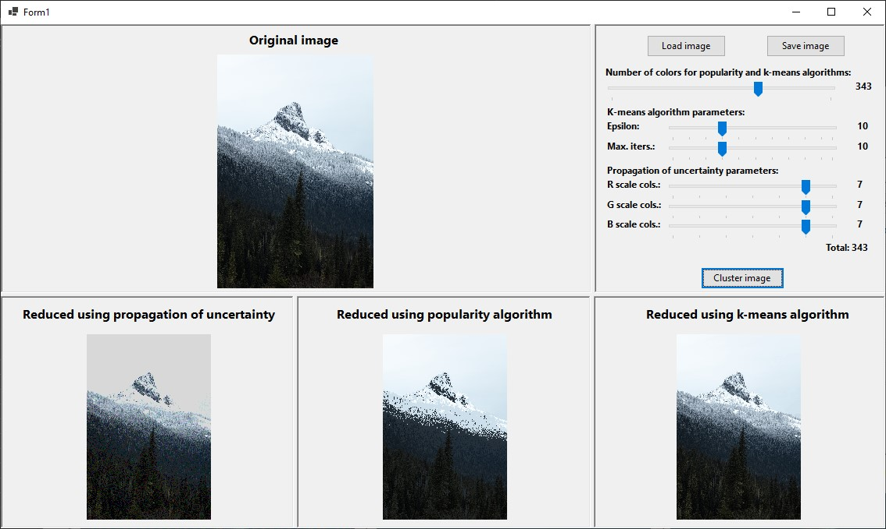
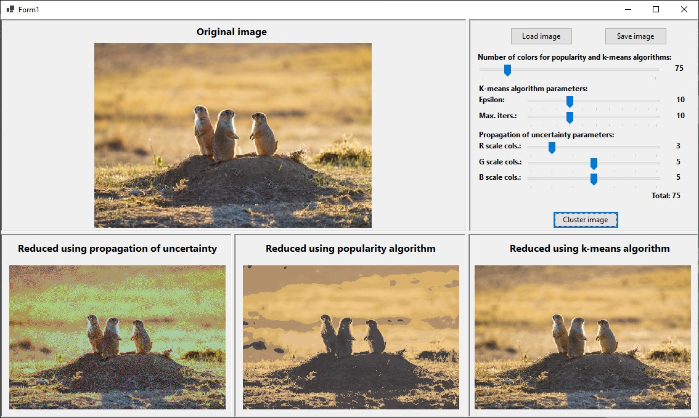

# Color Reducer

## Introduction

The project is a photo editor allowing for reduction of the number
of colors in a photo using the following algorithms:
* Propagation of uncertainty
* Popularity algorithm
* K-Means algorithm

## Installation and compilation

The project has been tested on a Windows 10 device, 
and compiled using .NET 8.0. Note that as a WinForms project, 
it isn't suited for being used on operating systems other 
than Windows.

If you want to compile the application on your device, install the program, by running `git clone` on this repository:
```shell
git clone https://github.com/kubapoke/color-reducer
```
Subsequently, run:
```shell
dotnet build <solution-file>
```
Where `<solution-file>` should be the path to the provided `ColorReducer.sln` file.
This requires having `dotnet` installed.

## Usage
Run the program by running
```shell
./ColorReducer
```
in the executable folder, or manually opening the 
```ColorReducer.exe``` file.

Upon launching the application you will be presented with the main window
as well as a menu on the right side of the screen. You should start
by pressing the ```Load image``` button, which will allow you to pick
a photo from your computer to be reduced.

Afterwards, you can configure several parameters:
* Number of colors for popularity and K-Means algorithms.
* Parameters for the K-Means algorithm, ```Epsilon``` (precision threshold at which
the algorithm stops) and ```Max. iters.``` (maximum number of iterations allowed).
* Number of colors on each scale for the propagation of uncertainty
algorithm (this is done separately, as  this algorithm uses a color palette
independent of the photo used).

After setting them up, press the ```Cluster image``` button to generate three
versions of the provided photo with their colors reduced. The results might look 
similar to this:





Afterwards, you can press the ```Save image``` button to export the
clustered images into your chosen directory.

All images included in this project are sourced from
the [Unsplash](https://unsplash.com/) website.